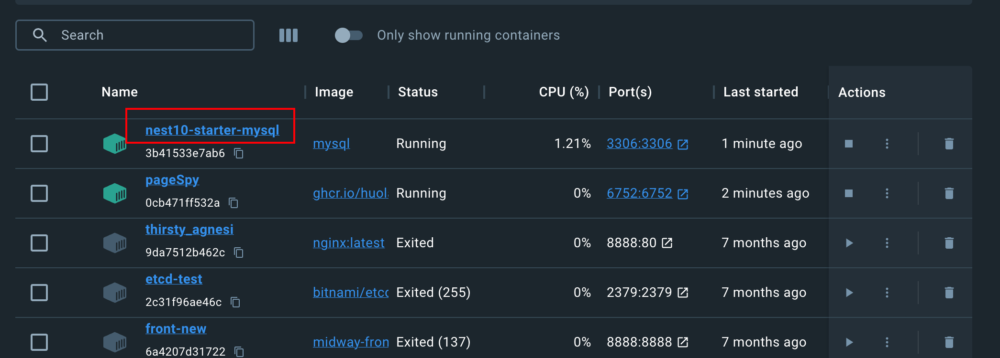
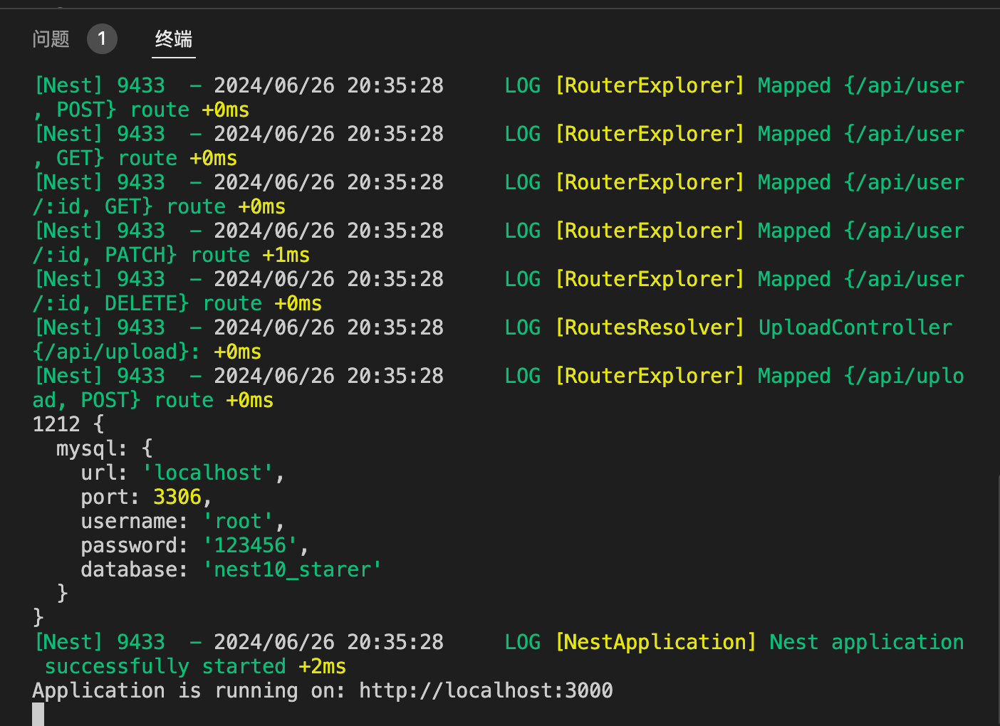

<p align="center">
  <a href="http://nestjs.com/" target="blank"></a>
</p>

<h1 align="center">
  <a href="https://github.com/codercup/nest-admin" target="_blank">nest admin</a>
</h1>

## Description

> Nestjs 版本 v10
> 项目曾用名：`nest-starter`

Nestjs + MySQL + Prisma + jwt + swagger + Docker


## 提前准备

启动 `Docker` ，运行 `MySQL`，文档在[mysql.md](./config/mysql.md)

`MySQL` 运行成功如下：


整个服务运行成功如下：


## Installation

> 推荐使用 `pnpm` 作为包管理工具, 版本 `>=7.30`。

```bash
$ pnpm i
```

## Running the app

```bash
# development
$ pnpm start

# watch mode
$ pnpm start:dev
$ pnpm dev

# production mode
$ pnpm start:prod
```

服务运行端口：`5555`

> swagger 文档地址：`http://localhost:5555/api-docs`

## 配套的前端项目

[nest-admin-web](https://github.com/codercup/nest-admin-web)

服务运行端口：`6666`

> 还在开发中，敬请期待。
